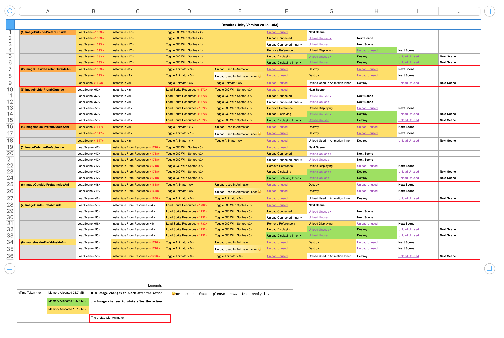

# UnityTextureMemoryResearch

A project accompanying [this research](https://gametorrahod.com/unity-texture-memory-loading-unloading-7054819e4ae8). It revolves around `Resource.UnloadAsset`, `Resources.UnloadUnusedAssets`, `Resources` folder and prefabs. I hope you learn something from this!
